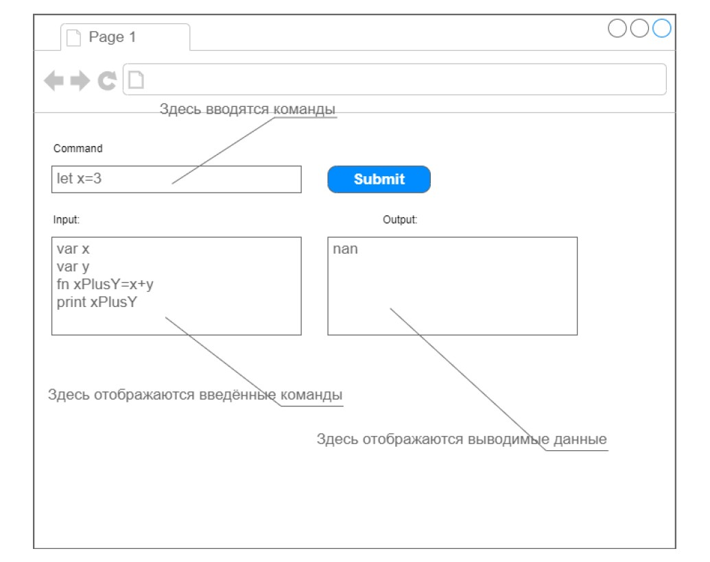
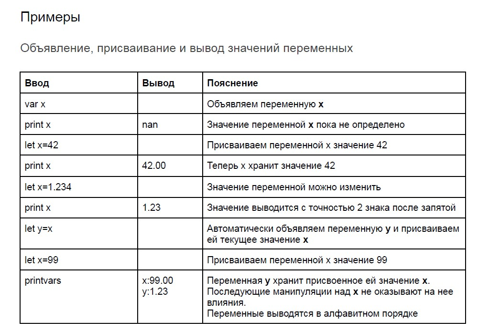
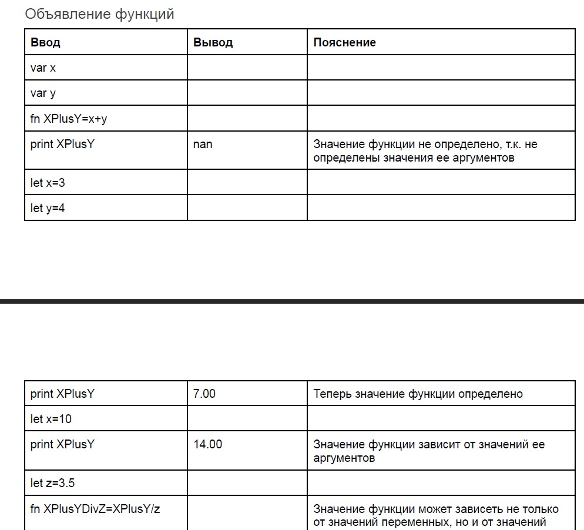

## _Данное тестовое в процессе, пока что еще не готово :(_

# Тестовое задание для компании iSpring

### Разработайте на JavaScript программу «Калькулятор», позволяющую объявлять переменные и функции и выполнять арифметические операции над ними.

#### Решение должно использовать объектно-ориентированный подход, содержать подходящие классы и структуры, моделирующие сущности предметной области. Примените подходящие для решения задачи контейнеры, встроенные в JavaScript.

---

### Клонируем репо

### Переходим на ветку oop-calculator-project

[> Ссылка на репо <](https://github.com/Vagoalex/iSpring-test-task/tree/oop-calculator-project)

### Коротко о задании:

