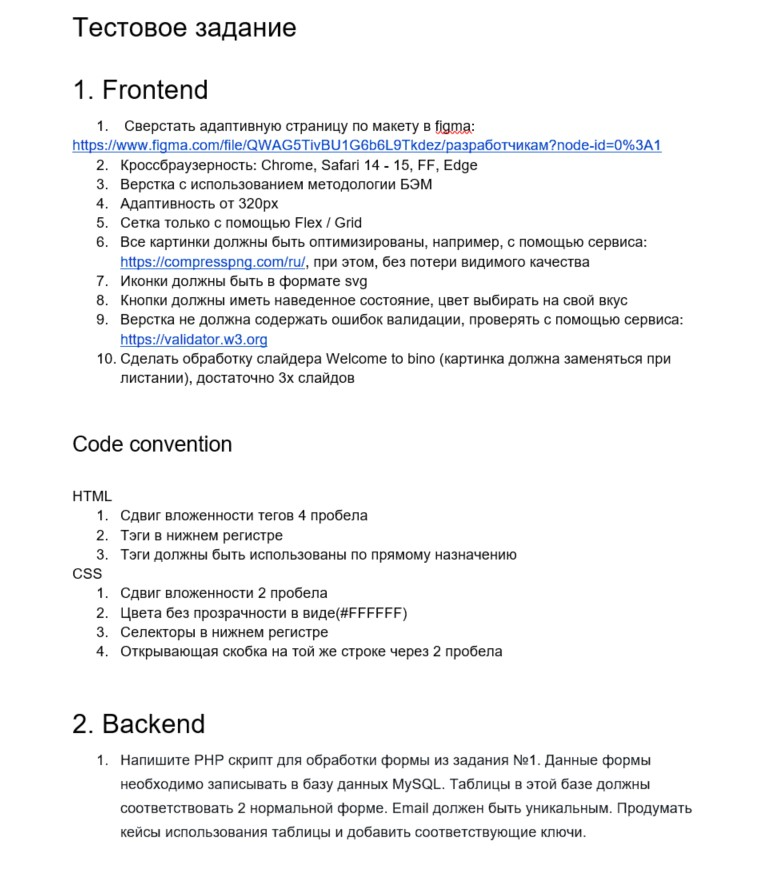
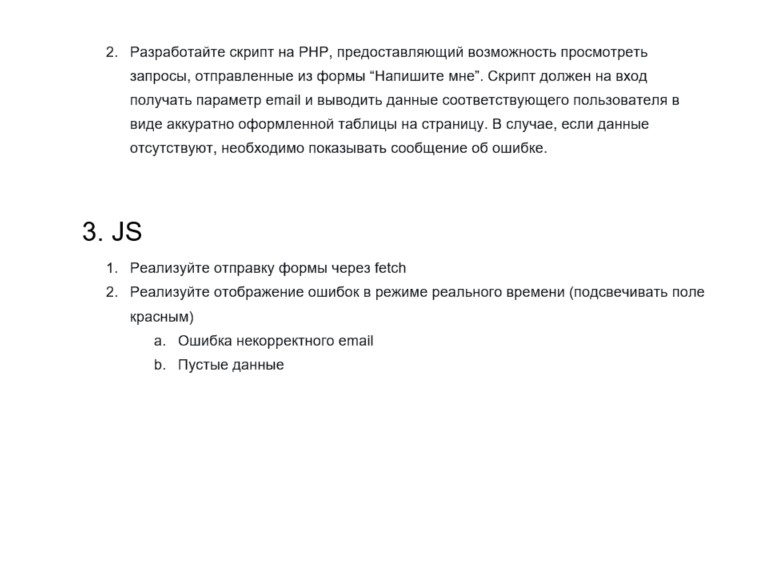

# Тестовые задания для компании iSpring

## № 1 - Адаптивная верстка лендоса + PHP + SQL

### _Стэк: на HTML, CSS, vanilla JavaScript_

### Выполнено все, кроме PHP и SQL (ну это же бэк, камон :) )

---

#### Клонируем репо

#### Открываем папку с клонированными файлами. У вас должен стоять плагин scss и live server.

```
 нажимаем Go Live и открываем localhost
```

---

[> Ссылка на деплой <](https://vagoalex.github.io/iSpring-test-task/index.html)

[> Ссылка на макет <](https://www.figma.com/file/QWAG5TivBU1G6b6L9Tkdez/%D1%80%D0%B0%D0%B7%D1%80%D0%B0%D0%B1%D0%BE%D1%82%D1%87%D0%B8%D0%BA%D0%B0%D0%BC?node-id=0%3A1)

[> Ссылка на компрессор картинок для задания <](https://compresspng.com/ru/)

[> Ссылка на валидатор для задания <](https://validator.w3.org)

### Коротко о задании № 1:



