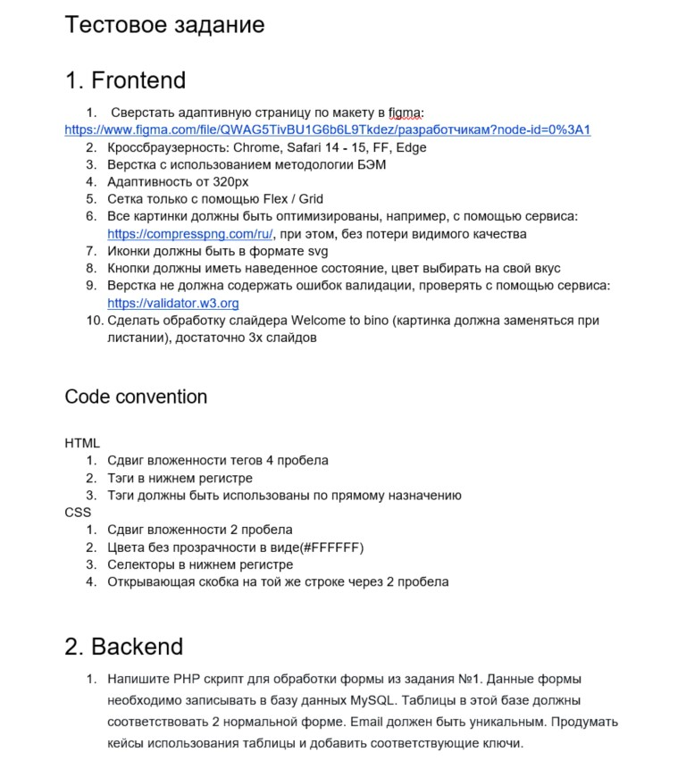
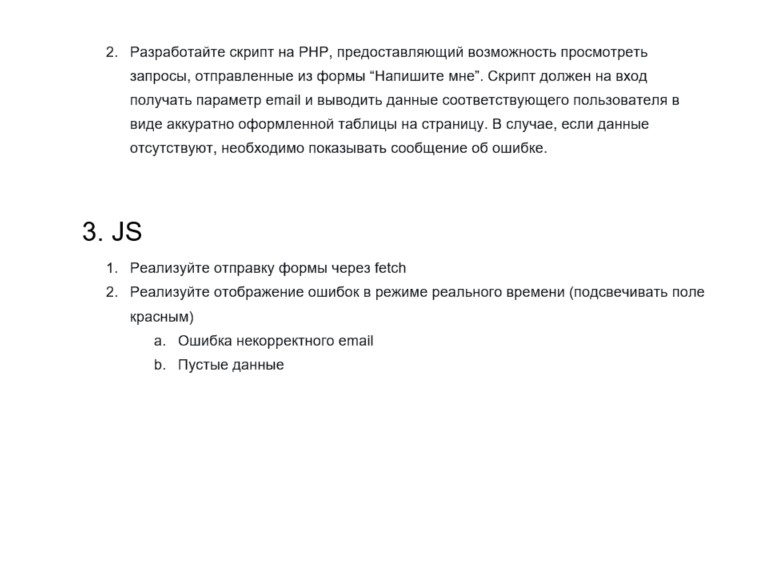

# Тестовое задание для компании iSpring

### _Стэк: на HTML, CSS, vanilla JavaScript и немного магии на PHP и postgreSQL, которую я не выполнил, так как пока что нет знаний php и баз данных_

---

## Клонируем репо

## Переходим на ветку layout-project

## Открываем папку с клонированными файлами. У вас должен стоять плагин scss и live server.

```
нажимаем Go Live и открываем localhost
```

---

[> Ссылка на деплой <](https://vagoalex.github.io/iSpring-test-task/index.html)

[> Ссылка на репо <](https://github.com/Vagoalex/iSpring-test-task/tree/layout-project)

[> Ссылка на макет <](https://www.figma.com/file/QWAG5TivBU1G6b6L9Tkdez/%D1%80%D0%B0%D0%B7%D1%80%D0%B0%D0%B1%D0%BE%D1%82%D1%87%D0%B8%D0%BA%D0%B0%D0%BC?node-id=0%3A1)

[> Ссылка на компрессор картинок для задания <](https://compresspng.com/ru/)

[> Ссылка на валидатор для задания <](https://validator.w3.org)

### Коротко о задании:



